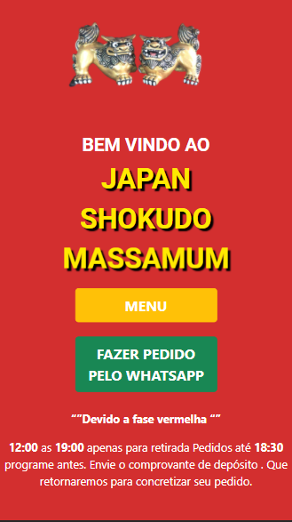
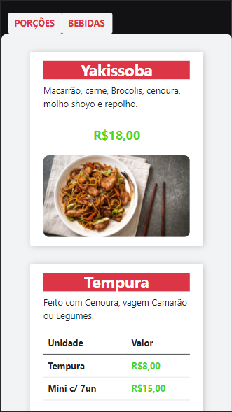

### 🥤 Japan Shokudo Massamum

 
  Durante a pandemia, diversos estabelecimentos e instituições tiveram que se adaptar a tecnlogia  ...🌌
    
    E com o <strong>Shokudo Massamum</strong>👨🏽‍🚀 Não foi direfente,
    
   Esse Projeto foi desenvolvido para auxiliar o restaurante nesse momento de pandemia,
    

 
 
 
 
 
 

### 🍣 Cardápio digital

  O cardápio digital proporciona ao cliente um pré atendimento,
   
  Atráves dele o cliente tem uma íncrivel experiência, 
   
  Basta apontas seu celular ao QR Code, que terá acesso ao Menu do cardápio.

### Fallow me and Contact me

  
  

  

 

### Desenvolvido por Gustavo Mendes.
